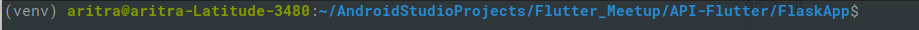
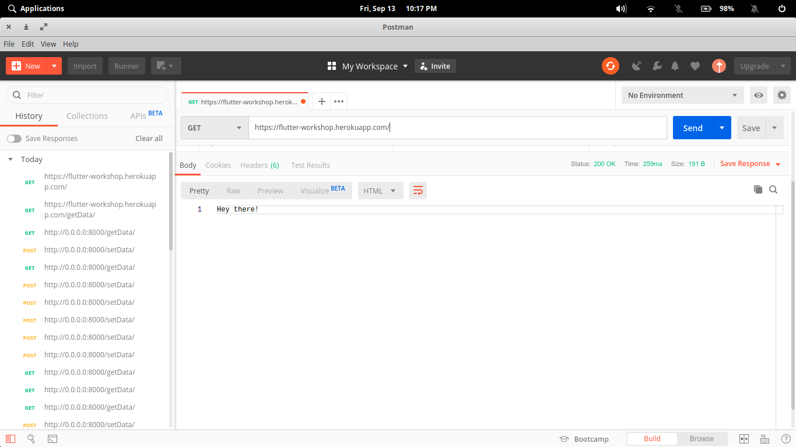

## Ways to get about it

The following ways are specially curated with the help of an API guy (used him to get rid of him :speak_no_evil:)

*  Create a Folder which will hold all of you `Flask` app configurations and the app itself.
* **Prerequisites**: `pip install virtualenv`
* Create a virtual environment `python3 -m venv <folder name>` This creates a `<folder name>` folder inside the directory we are in.
* Activate the environment 
  * **Linux**: `source <folder name>/bin/activate`
  * **Windows**: `<folder name>\Scripts\activate.bat` 



* **Requirements**: We need to install `Flask` and `gunicorn` for the following steps
  * `pip install Flask`
  * `pip install gunicorn`
* We need to make two files named `Procfile` and `requirements.txt`
* Now come the `app.py`

## A Basic Flask Application:

```python
from flask import Flask,jsonify,make_response,request
import json

app = Flask(__name__)

@app.route("/")
def home():
    return "Hey there!"

if __name__ == "__main__":
    app.run(host='0.0.0.0', debug=False, port=8000)
```

## The application Decoded (literally :jack_o_lantern: )

### Get the data

```python
@app.route("/getData/")
def getdata():
    # Read the data from the json file
    with open("data.json", "r") as read_file:
        data = json.load(read_file)
    # Return a response and the status code as 200 ^_^
    return make_response(jsonify(data),200)
```


### Post the data from app and store it :grin:

``` python
@app.route("/setData/",methods=["POST"])
def setdata():
    # Read the data from the json file
    # The file is a list of dictionaries
    with open("data.json", "r") as read_file:
        data = json.load(read_file)
    # Get the data that has been posted
    # which is a dictionary
    data_posted = request.get_json()
    # append to the list the newly entered dictionary
    data.append(data_posted)
    # Open the file in write mode
    # And dump the data
    with open("data.json", "w") as write_file:
        json.dump(data,write_file)
    # Return a happy status ^_^
    return make_response(jsonify({"success":True}),200)
```


## Procfile:

```
web: gunicorn -w 17 -b :$PORT app:app
```


## requirements.txt:

```
Flask
gunicorn
```

:confetti_ball: **A RESTful API has been made**


## Let us check with the endpoints, shall we?




## Test and then Deploy

* make the folder a git repository `git init`
* create a `Github` repository of your own and push the folder to the repository
* create a `Heroku` account and deploy the repository and voila. 